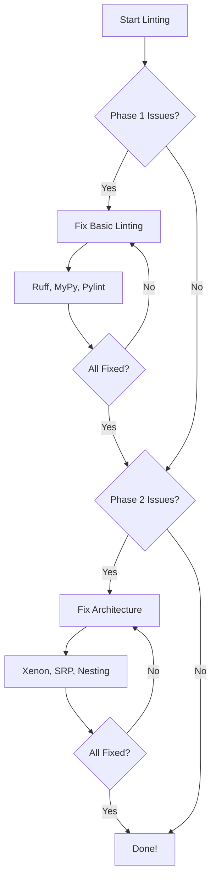

# Consultant Grade Improvements - PR Breakdown

**Purpose**: Detailed implementation breakdown of grade improvements into manageable, atomic pull requests

**Scope**: Complete implementation from current state through A+ grades across all evaluation categories

**Overview**: Comprehensive breakdown of the Consultant Grade Improvements into 6 manageable, atomic
    pull requests. Each PR is designed to be self-contained, testable, and maintains application functionality
    while incrementally building toward A+ grades. Includes detailed implementation steps, file
    structures, testing requirements, and success criteria for each PR.

**Dependencies**: Existing linter patterns, CLI structure, CI/CD workflows

**Exports**: PR implementation plans, file structures, testing strategies, and success criteria for each development phase

**Related**: AI_CONTEXT.md for evaluation findings, PROGRESS_TRACKER.md for status tracking

**Implementation**: Atomic PR approach with detailed step-by-step implementation guidance and comprehensive testing validation

---

## Overview
This document breaks down the Consultant Grade Improvements into 6 atomic PRs. Each PR is designed to be:
- Self-contained and testable
- Maintains a working application
- Incrementally builds toward A+ grades
- Revertible if needed

---

## PR1: File Length Linter

### Goal
Create a new linter that enforces maximum file length limits (500 LOC default) to prevent files like `src/cli.py` (2,014 lines) from accumulating.

### Scope
- New linter module: `src/linters/file_length/`
- CLI command: `thailint file-length`
- Configuration: `.thailint.yaml` section
- Pre-commit integration
- Justfile recipe

### Files to Create

#### `src/linters/file_length/__init__.py`
```python
"""
Purpose: Export FileLengthRule for automatic discovery by the rule registry
Scope: Module initialization and public API exposure
"""
from .linter import FileLengthRule

__all__ = ["FileLengthRule"]
```

#### `src/linters/file_length/config.py`
```python
"""
Purpose: Configuration dataclass for file-length linter
Scope: Define configurable thresholds and ignore patterns
"""
from dataclasses import dataclass, field

@dataclass
class FileLengthConfig:
    enabled: bool = True
    max_lines: int = 500
    ignore: list[str] = field(default_factory=list)

    # Language-specific overrides
    python_max_lines: int | None = None
    typescript_max_lines: int | None = None

    @classmethod
    def from_dict(cls, config: dict, language: str | None = None) -> "FileLengthConfig":
        # Load from .thailint.yaml with language overrides
        ...
```

#### `src/linters/file_length/linter.py`
```python
"""
Purpose: FileLengthRule implementation for detecting oversized files
Scope: Multi-language file length analysis and violation reporting
"""
from src.core.base import MultiLanguageLintRule, BaseLintContext
from src.core.types import Violation

class FileLengthRule(MultiLanguageLintRule):
    @property
    def rule_id(self) -> str:
        return "file-length.max-lines-exceeded"

    def _check_python(self, context: BaseLintContext) -> list[Violation]:
        # Count lines and check against max_lines
        ...

    def _check_typescript(self, context: BaseLintContext) -> list[Violation]:
        # Count lines and check against max_lines
        ...
```

#### `src/linters/file_length/analyzer.py`
```python
"""
Purpose: Line counting and analysis logic for file-length linter
Scope: Accurate line counting with configurable rules
"""

def count_lines(content: str, exclude_blank: bool = False, exclude_comments: bool = False) -> int:
    """Count lines in file content with optional exclusions."""
    ...
```

### Files to Modify

#### `src/cli.py`
Add new command (temporarily, will be moved in PR3):
```python
@cli.command("file-length")
@click.argument("paths", nargs=-1, type=click.Path(exists=True))
@click.option("--max-lines", default=500, help="Maximum lines per file")
@common_options
def file_length_command(paths, max_lines, format, verbose, project_root):
    """Check files for excessive length."""
    ...
```

#### `.thailint.yaml`
Add configuration section:
```yaml
file-length:
  enabled: true
  max_lines: 500
  ignore:
    - "tests/**"
    - "**/__init__.py"
  python:
    max_lines: 500
  typescript:
    max_lines: 600
```

#### `justfile`
Add recipe:
```just
# Lint file length
lint-file-length *ARGS:
    poetry run python -m src.cli file-length {{ARGS}}
```

Update `lint-full` to include file-length.

#### `.pre-commit-config.yaml`
Add to pre-push stage:
```yaml
- id: lint-file-length
  name: Check file length
  entry: just lint-file-length src/
  language: system
  pass_filenames: false
  stages: [pre-push]
```

### Testing Requirements

#### Unit Tests (`tests/unit/linters/file_length/`)
- `test_config.py`: Config loading, language overrides, defaults
- `test_analyzer.py`: Line counting edge cases
- `test_linter.py`: Violation detection, threshold behavior
- `test_cli_interface.py`: CLI command behavior

#### Test Cases
1. Empty file: No violation
2. Single line file: No violation
3. File at exactly 500 lines: No violation
4. File at 501 lines: Violation
5. File at 2,014 lines (like cli.py): Violation with correct count
6. Ignored patterns: Files matching ignore patterns skipped
7. Language-specific thresholds: Python vs TypeScript different limits

### Success Criteria
- [ ] `thailint file-length src/cli.py` reports violation
- [ ] `just lint-file-length` command works
- [ ] Configuration loads from `.thailint.yaml`
- [ ] All 3 output formats work (text, JSON, SARIF)
- [ ] Pre-push hook includes file-length check
- [ ] Unit tests pass with 90%+ coverage for new code

---

## PR2: CLI Modularization - Infrastructure

### Goal
Create `src/cli/` package structure and extract configuration commands as the first modularization step.

### Scope
- Create CLI package infrastructure
- Extract config group (~200 lines)
- Create shared utilities
- Maintain backward compatibility

### Files to Create

#### `src/cli/__init__.py`
```python
"""
Purpose: CLI package entry point and public API
Scope: Re-export main CLI group for backward compatibility
"""
from .main import cli

__all__ = ["cli"]
```

#### `src/cli/main.py`
```python
"""
Purpose: Main CLI group definition and core setup
Scope: Click group configuration, version, help text
"""
import click

@click.group()
@click.version_option()
def cli():
    """Thai-Lint: Governance for AI-generated code."""
    pass
```

#### `src/cli/utils.py`
```python
"""
Purpose: Shared CLI utilities and helper functions
Scope: Project root resolution, output formatting, common decorators
"""
from pathlib import Path
import click

def get_project_root(explicit: Path | None = None) -> Path:
    """Determine project root with fallback logic."""
    ...

def format_violations(violations: list, format: str) -> str:
    """Format violations for output."""
    ...

# Common option decorators
project_root_option = click.option(
    "--project-root", "-r",
    type=click.Path(exists=True),
    help="Project root directory"
)
```

#### `src/cli/config.py`
```python
"""
Purpose: Configuration management commands
Scope: show, get, set, reset, init-config commands
"""
import click
from .main import cli
from .utils import project_root_option

@cli.group(name="config")
def config_group():
    """Configuration management commands."""
    pass

@config_group.command("show")
@project_root_option
def show_config(project_root):
    """Show current configuration."""
    ...

@config_group.command("get")
@click.argument("key")
def get_config(key):
    """Get a configuration value."""
    ...

@config_group.command("set")
@click.argument("key")
@click.argument("value")
def set_config(key, value):
    """Set a configuration value."""
    ...

@config_group.command("reset")
def reset_config():
    """Reset configuration to defaults."""
    ...

@cli.command("init-config")
def init_config():
    """Initialize configuration file."""
    ...
```

### Files to Modify

#### `src/cli.py`
Reduce to re-exports:
```python
"""
Purpose: CLI entry point (thin wrapper for backward compatibility)
Scope: Re-export CLI from modular package
"""
# Import from new modular structure
from src.cli import cli
from src.cli.config import config_group, init_config

# Re-export for backward compatibility
# Linter commands still defined here (moved in PR3)

if __name__ == "__main__":
    cli()
```

### Migration Strategy
1. Create new `src/cli/` package
2. Copy utilities to `src/cli/utils.py`
3. Move config commands to `src/cli/config.py`
4. Update `src/cli.py` to import from new locations
5. Run all tests to verify no regressions

### Testing Requirements
- All existing CLI tests must pass unchanged
- No user-facing behavior changes
- `python -m src.cli config show` works
- `python -m src.cli init-config` works

### Success Criteria
- [ ] All config commands work identically
- [ ] `src/cli.py` reduced by ~200-300 lines
- [ ] All existing tests pass
- [ ] No user-facing changes
- [ ] Imports work from both old and new locations

---

## PR3: CLI Modularization - Linter Commands

### Goal
Extract all linter commands into organized modules, reduce `src/cli.py` to <100 lines.

### Scope
- Create `src/cli/linters/` package
- Extract all 10 linter commands
- Organize by logical grouping
- Create thin `cli.py` entry point

### Files to Create

#### `src/cli/linters/__init__.py`
```python
"""
Purpose: Export all linter commands for CLI registration
Scope: Aggregate exports from submodules
"""
from .code_quality import nesting_command, srp_command, dry_command, magic_numbers_command
from .code_patterns import print_statements_command, method_property_command, stateless_class_command
from .documentation import file_header_command
from .structure import file_placement_command, file_length_command

__all__ = [
    "nesting_command", "srp_command", "dry_command", "magic_numbers_command",
    "print_statements_command", "method_property_command", "stateless_class_command",
    "file_header_command", "file_placement_command", "file_length_command"
]
```

#### `src/cli/linters/shared.py`
```python
"""
Purpose: Shared utilities for linter commands
Scope: Orchestrator setup, common options, execution helpers
"""
from src.orchestrator import Orchestrator

def setup_orchestrator(project_root: Path, config: dict) -> Orchestrator:
    """Create and configure orchestrator for linting."""
    ...

def execute_linting(orchestrator: Orchestrator, paths: list[Path]) -> list:
    """Execute linting and return violations."""
    ...

# Common linter options
linter_options = [
    click.option("--format", type=click.Choice(["text", "json", "sarif"]), default="text"),
    click.option("--verbose", "-v", is_flag=True),
    click.option("--project-root", "-r", type=click.Path(exists=True)),
]
```

#### `src/cli/linters/code_quality.py`
```python
"""
Purpose: Code quality linter commands
Scope: nesting, srp, dry, magic-numbers commands
"""
import click
from ..main import cli
from .shared import linter_options, setup_orchestrator, execute_linting

@cli.command("nesting")
# ... options
def nesting_command(...):
    """Check nesting depth violations."""
    ...

@cli.command("srp")
def srp_command(...):
    """Check Single Responsibility Principle violations."""
    ...

@cli.command("dry")
def dry_command(...):
    """Check for duplicate code."""
    ...

@cli.command("magic-numbers")
def magic_numbers_command(...):
    """Check for magic numbers."""
    ...
```

#### `src/cli/linters/code_patterns.py`
```python
"""
Purpose: Code pattern linter commands
Scope: print-statements, method-property, stateless-class commands
"""
# Similar structure to code_quality.py
```

#### `src/cli/linters/documentation.py`
```python
"""
Purpose: Documentation linter commands
Scope: file-header command
"""
# Similar structure
```

#### `src/cli/linters/structure.py`
```python
"""
Purpose: Project structure linter commands
Scope: file-placement, file-length commands
"""
# Similar structure
```

### Final `src/cli.py` Target
```python
"""
Purpose: CLI entry point (thin wrapper)
Scope: Import and register all CLI components
Overview: Minimal entry point that imports CLI components from modular package.
    Maintains backward compatibility while delegating to organized modules.
"""
from src.cli.main import cli
from src.cli.config import config_group
from src.cli.linters import (
    nesting_command, srp_command, dry_command, magic_numbers_command,
    print_statements_command, method_property_command, stateless_class_command,
    file_header_command, file_placement_command, file_length_command
)

# Commands are registered via decorators in their modules
# This file exists for backward compatibility

if __name__ == "__main__":
    cli()
```

### Success Criteria
- [ ] `src/cli.py` under 100 lines
- [ ] All linter commands work identically
- [ ] `just lint-full` passes
- [ ] All tests pass unchanged
- [ ] `thailint file-length src/cli.py` shows NO violation
- [ ] `thailint file-length src/cli/` shows NO violations

---

## PR4: Performance Optimizations

### Goal
Address Agent4's concerns to improve B+ → A grade for performance.

### Scope
1. Optional shared AST cache in orchestrator
2. Streaming tokenization for large files in DRY linter
3. Lazy command loading (if beneficial)

### Files to Modify

#### `src/orchestrator/orchestrator.py`
```python
class Orchestrator:
    def __init__(self, ..., cache_ast: bool = False):
        self._ast_cache: dict[Path, ast.AST] = {} if cache_ast else None

    def get_ast(self, path: Path, content: str) -> ast.AST:
        """Get AST, using cache if enabled."""
        if self._ast_cache is not None:
            if path not in self._ast_cache:
                self._ast_cache[path] = ast.parse(content)
            return self._ast_cache[path]
        return ast.parse(content)

    def clear_ast_cache(self):
        """Clear AST cache to free memory."""
        if self._ast_cache is not None:
            self._ast_cache.clear()
```

#### `src/linters/dry/python_analyzer.py`
```python
# Add streaming tokenization for files > 1MB
LARGE_FILE_THRESHOLD = 1_000_000  # 1MB

def tokenize_file(content: str, file_size: int) -> list[Token]:
    if file_size > LARGE_FILE_THRESHOLD:
        return tokenize_streaming(content)
    return tokenize_full(content)

def tokenize_streaming(content: str) -> list[Token]:
    """Memory-efficient tokenization for large files."""
    ...
```

### Testing Requirements
- Benchmark tests showing improvement
- Memory usage tests for large files
- Regression tests for existing functionality

### Success Criteria
- [ ] Benchmark shows improvement for multi-linter runs
- [ ] Large file handling (>1MB) doesn't cause memory issues
- [ ] All existing tests pass
- [ ] CLI startup time maintained

---

## PR5: Security Hardening

### Goal
Address Agent7's concerns to improve A- → A+ grade for security.

### Scope
1. Add SBOM generation to publish workflow
2. Add conditional blocking for critical CVEs (CVSS > 7.0)

### Files to Modify

#### `.github/workflows/security.yml`
```yaml
jobs:
  security-scan:
    steps:
      - name: Run Safety check
        id: safety
        run: |
          poetry export -f requirements.txt | safety check --stdin --json > safety.json || true

      - name: Check for Critical Vulnerabilities
        run: |
          python scripts/check_critical_cves.py safety.json
          # Exits non-zero if any CVSS > 7.0
```

#### `.github/workflows/publish-pypi.yml`
```yaml
jobs:
  build:
    steps:
      - name: Generate SBOM
        run: |
          pip install cyclonedx-bom
          cyclonedx-py -o sbom.json --format json

      - name: Upload SBOM
        uses: actions/upload-artifact@v4
        with:
          name: sbom
          path: sbom.json
```

#### `scripts/check_critical_cves.py`
```python
"""Check for critical CVEs in safety output."""
import json
import sys

def main():
    with open(sys.argv[1]) as f:
        data = json.load(f)

    critical = [v for v in data.get("vulnerabilities", [])
                if float(v.get("cvss", 0)) > 7.0]

    if critical:
        print(f"CRITICAL: {len(critical)} vulnerabilities with CVSS > 7.0")
        for v in critical:
            print(f"  - {v['package']}: {v['vulnerability_id']} (CVSS {v['cvss']})")
        sys.exit(1)

if __name__ == "__main__":
    main()
```

### Success Criteria
- [ ] Critical CVEs block the build
- [ ] SBOM generated on every release
- [ ] SBOM uploaded as artifact
- [ ] Security workflow passes

---

## PR6: Documentation Enhancements

### Goal
Address Agent3's concerns to improve A → A+ grade for documentation.

### Scope
1. Quick reference cards (1-page guides)
2. Visual decision trees (Mermaid diagrams)
3. Coverage badge in README

### Files to Create

#### `docs/quick-reference/README.md`
```markdown
# Quick Reference Guides

One-page reference cards for common thai-lint tasks.

- [CLI Cheatsheet](cli-cheatsheet.md)
- [Configuration Reference](configuration-cheatsheet.md)
- [Linter Selection Guide](linter-selection.md)
```

#### `docs/quick-reference/cli-cheatsheet.md`
```markdown
# CLI Quick Reference

## Most Common Commands

| Command | Purpose |
|---------|---------|
| `thailint file-length src/` | Check file sizes |
| `thailint srp src/` | Check class responsibilities |
| `thailint nesting src/` | Check nesting depth |
| `thailint dry src/` | Find duplicate code |

## Output Formats
- `--format text` (default)
- `--format json`
- `--format sarif`

...
```

### Files to Modify

#### `AGENTS.md`
Add Mermaid diagram for two-phase linting:
```markdown
## Two-Phase Linting Decision Tree



#### `README.md`
Add coverage badge:
```markdown
[](https://codecov.io/gh/user/thai-lint)
```

### Success Criteria
- [ ] Quick reference cards created
- [ ] Mermaid diagrams render in GitHub
- [ ] Coverage badge visible in README
- [ ] Documentation builds without errors

---

## Implementation Guidelines

### Code Standards
- All new code: Pylint 10.00/10
- All new code: Xenon A-grade complexity
- All new code: MyPy strict mode compliant
- File headers per `.ai/docs/FILE_HEADER_STANDARDS.md`
- Google-style docstrings on all public functions

### Testing Requirements
- Unit tests for all new code
- Integration tests for CLI changes
- Coverage maintained at 87%+
- All existing tests must pass

### Documentation Standards
- File headers on all new files
- Docstrings on all public functions
- Update relevant docs if behavior changes
- Examples for new features

### Security Considerations
- No secrets in code
- Input validation for CLI arguments
- Safe file operations with encoding handling

### Performance Targets
- CLI startup time: <0.5s
- Single file linting: <1s
- Large file (>1MB) linting: <5s

---

## Success Metrics

### Launch Metrics
- All 6 PRs merged successfully
- All tests passing
- All grades A or A+

### Ongoing Metrics
- No file-length violations in codebase
- Pre-commit hooks prevent regressions
- Security scans block critical CVEs
